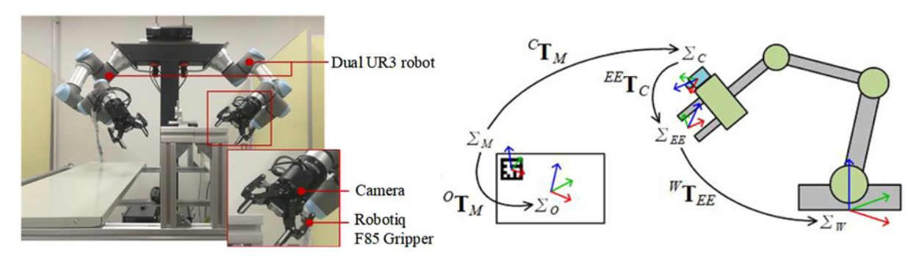

# hand-eye-calibration
This Eye-in-Hand calibration code aims at making a vision module for pose estimation using the cameras integrated into a UR3 robot gripper. 

The system as well as the calculations are as described by the following figure. 

This module was utilized in a developing a method to teach robots to use electric tools in robotic workcells. This method is detailed in [this paper ](https://ieeexplore.ieee.org/stamp/stamp.jsp?tp=&arnumber=8674857). It was integrated in my lab's robotics development environemt. 